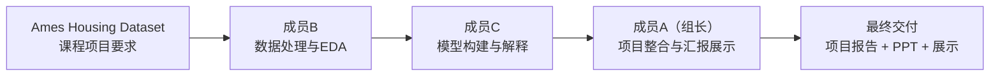

# 《房屋价格分析与预测》项目分工

## 1. 总体执行方式

本项目以 Ames Housing Dataset（艾姆斯房价数据集）为基础，目标是完成“数据预处理、探索性分析、机器学习建模、误差解释与结果汇报”的完整流程，并最终形成课程项目报告与课堂展示。

为了减少成员之间的重复沟通与返工，本项目采用单向协作流程：

**成员B → 成员C → 成员A（组长）**

其中：

* 成员B负责前期数据处理与探索分析；
* 成员C负责模型训练、调参与结果解释；
* 成员A作为组长负责任务制定、进度协调、最终PPT与课堂演讲。

---

## 2. 工作顺序示意图

顺序说明：

1. 成员B先完成数据清洗、特征工程与探索性分析，为后续模型提供可直接使用的数据。
2. 成员C基于成员B的处理结果完成模型训练、模型对比、误差分析与SHAP解释。
3. 成员A最后整合前两位成员的成果，统一文档格式、制作PPT并负责课堂演讲。

---

## 3. 项目评分点对应负责人

| 项目关注点                            | 本项目对应工作                       | 主要负责人   |
| -------------------------------- | ----------------------------- | ------- |
| Data preprocessing 数据预处理         | 缺失值处理、特征工程、编码与数据划分            | 成员B     |
| Exploratory Data Analysis 探索分析   | 房价分布、相关性分析、街区与面积分析            | 成员B     |
| Machine Learning Modeling 机器学习建模 | 线性回归、Lasso、Ridge、随机森林、XGBoost | 成员C     |
| Model evaluation 模型评估            | RMSE、R²、交叉验证与模型对比             | 成员C     |
| Model interpretation 模型解释        | SHAP分析、异常样本分析、误差诊断            | 成员C     |
| Project management 项目统筹          | 任务制定、进度安排、成果整合                | 成员A（组长） |
| Presentation & Report 汇报展示       | PPT、讲稿、课堂演讲与答辩                | 成员A（组长） |

---

## 4. 三位成员具体分工

---

### 第一棒：成员B，数据处理与探索分析负责人

负责方向：完成原始房价数据的清洗、转换与探索分析，为后续建模提供高质量数据。

工作输入：

* Ames Housing Dataset 原始数据
* 项目目标与分析需求

具体工作：

1. 检查数据规模、字段类型、缺失值与异常值。
2. 区分结构性缺失与真实缺失，并完成缺失值填补。
3. 完成特征工程，包括：

   * 房屋总面积
   * 总浴室数
   * 房龄与装修龄
   * 建筑年代分箱
4. 对分类变量完成有序编码与独热编码。
5. 对目标变量 `SalePrice` 进行对数变换。
6. 按 80%/20% 划分训练集与测试集。
7. 完成探索性数据分析（EDA）：

   * 房价分布分析
   * 面积与价格关系
   * 街区价格差异
   * 时间维度价格变化
   * 特征相关性热力图
8. 输出EDA中的关键发现与图表。

具体产出：

* 数据清洗脚本
* 特征工程代码
* 训练集与测试集
* EDA分析结果
* 图表素材（散点图、箱线图、热力图等）
* 数据处理说明文档

交付给下一棒：

* 成员C直接使用处理后的数据与EDA结果进行模型训练与解释。

---

### 第二棒：成员C，模型构建与模型解释负责人

负责方向：完成机器学习模型训练、调参与性能比较，并解释模型结果。

工作输入：

* 成员B处理后的训练集与测试集
* 成员B输出的EDA结果

具体工作：

1. 建立并训练以下模型：

   * 线性回归
   * Lasso 回归
   * Ridge 回归
   * 随机森林
   * XGBoost
2. 使用交叉验证完成参数调优。
3. 比较不同模型在训练集与测试集上的表现。
4. 计算并整理：

   * R²
   * RMSE
   * 模型泛化误差
5. 选出最终模型，并分析其优缺点。
6. 使用 SHAP 方法完成：

   * 全局特征重要性分析
   * 单样本预测解释
7. 分析高误差样本：

   * 极端低估样本
   * 极端高估样本
8. 输出模型分析结论与现实意义。

具体产出：

* 模型训练代码
* 参数调优结果
* 模型性能对比表
* SHAP解释图
* 误差分析结果
* 模型分析文档

交付给下一棒：

* 成员A根据模型结果与解释内容制作最终展示材料。

---

### 第三棒：成员A（组长），项目统筹与汇报负责人

负责方向：负责项目统筹、任务安排、最终材料整合以及课堂展示。

工作输入：

* 成员B的数据处理与EDA结果
* 成员C的模型分析与解释结果

具体工作：

1. 制定整体任务安排与时间节点。
2. 跟进项目进度，协调成员之间的交付。
3. 整合项目报告内容，统一格式与术语。
4. 提炼项目核心故事线：

   * 为什么研究房价预测
   * 数据如何处理
   * 模型如何构建
   * 得到了什么结论
5. 制作最终课堂展示PPT。
6. 编写课堂讲稿与展示提纲。
7. 负责最终课堂演讲。
8. 准备答辩问题，包括：

   * 为什么选择XGBoost
   * 为什么进行对数变换
   * SHAP的作用是什么
   * 模型误差来源有哪些
9. 检查最终提交材料是否完整。

具体产出：

* 最终项目报告
* 课堂展示PPT
* 演讲稿/展示提纲
* 答辩问题清单
* 最终提交文件整理

最终交付：

* 房屋价格分析与预测项目报告
* 模型代码与结果
* PPT展示材料
* 课堂演讲

---

## 5. 建议时间安排

项目截止时间：**2026年6月4日（周二）24:00**

| 顺序 | 成员      | 阶段目标               | 建议完成时间        |
| -- | ------- | ------------------ | ------------- |
| 1  | 成员B     | 完成数据清洗、特征工程与EDA分析  | 5月30日 - 6月1日  |
| 2  | 成员C     | 完成模型训练、调参与SHAP解释   | 6月1日 - 6月3日中午 |
| 3  | 成员A（组长） | 完成PPT、讲稿、项目整合与答辩准备 | 6月3日下午 - 6月4日 |
| 4  | 全组      | 最终检查与演示彩排          | 6月4日晚         |

---

## 6. 一次性交付约定

1. 每位成员优先完成自己的完整交付内容，不将未完成问题留给下一位成员处理。
2. 成员之间采用单向交付流程：

   * 成员B → 成员C
   * 成员C → 成员A
3. 成员A作为组长负责整体协调，但不参与中间返工循环。
4. 每位成员保留自己负责部分的代码与文档署名，方便课堂答辩时明确分工。
5. 所有图表、模型结果与最终结论必须保留对应的数据依据，确保展示内容可解释、可复现。
